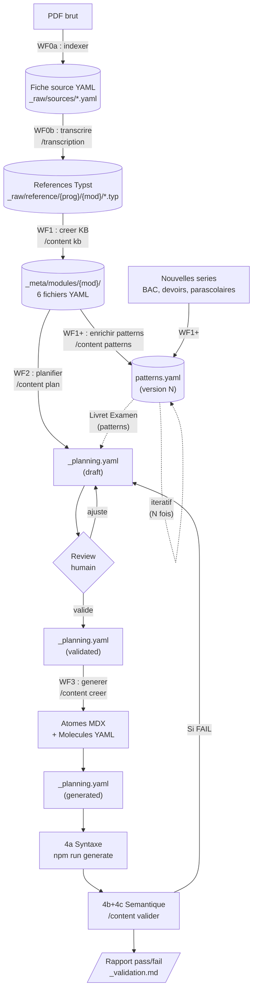
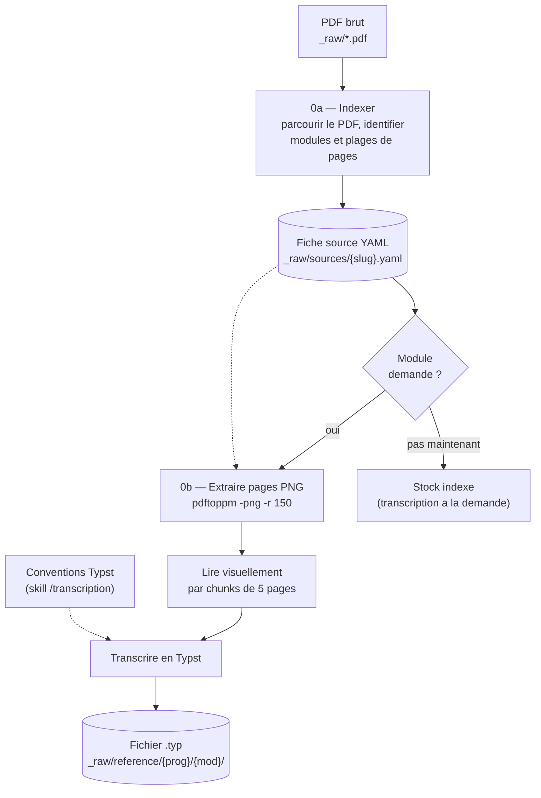
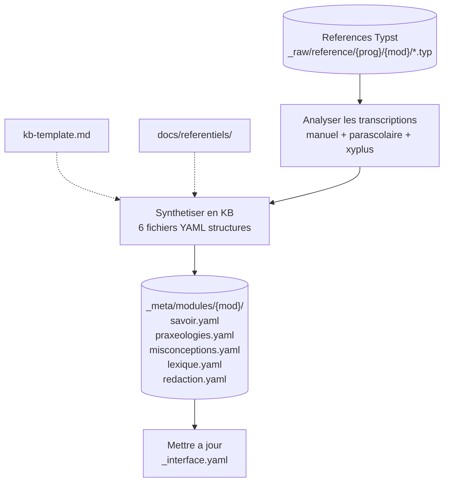
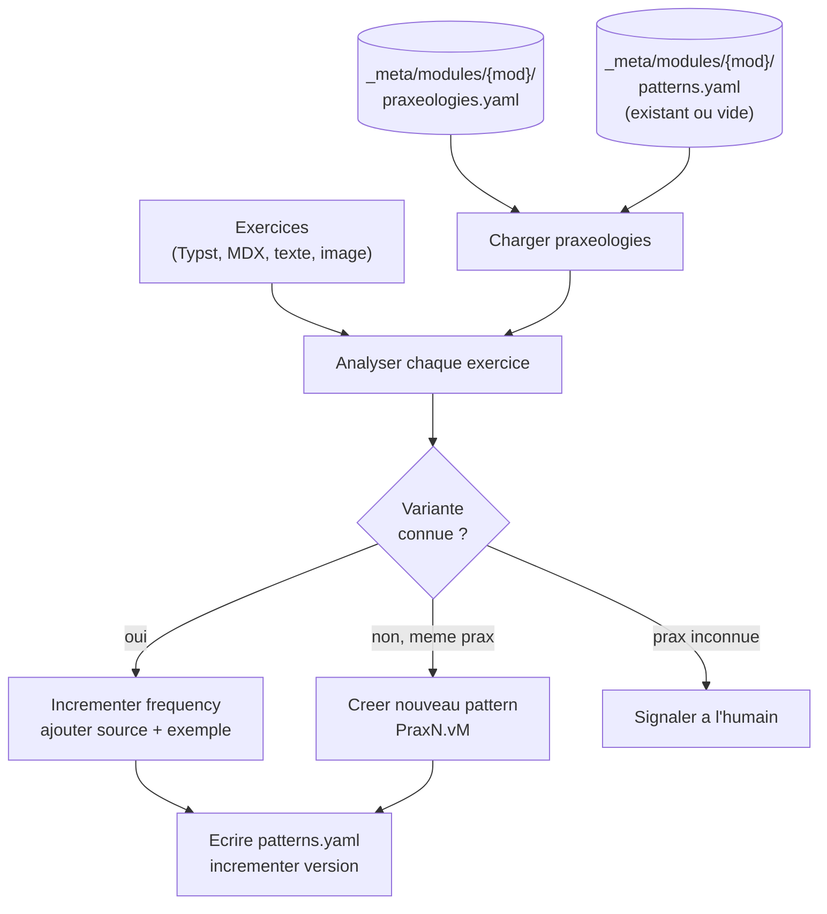
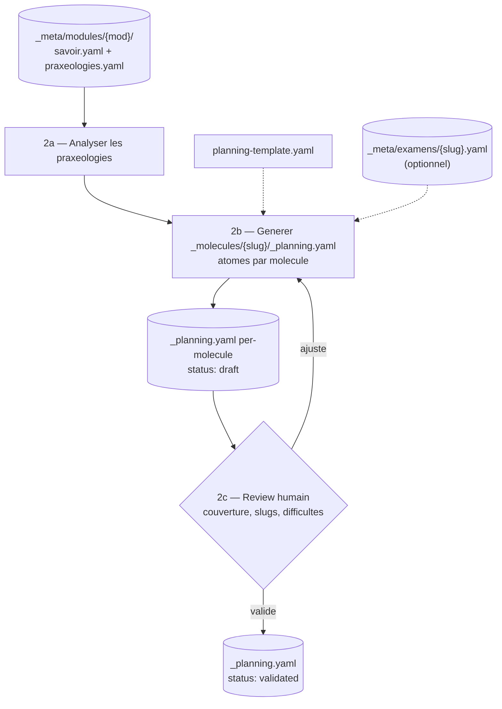
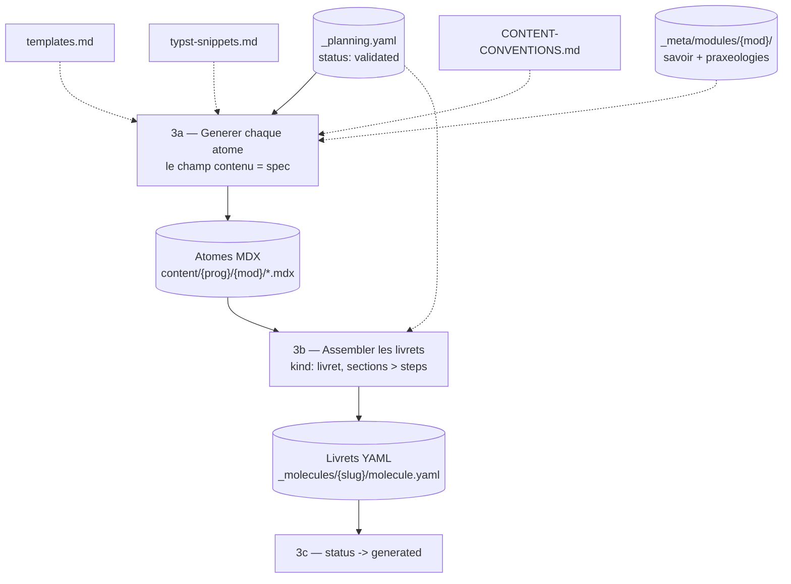
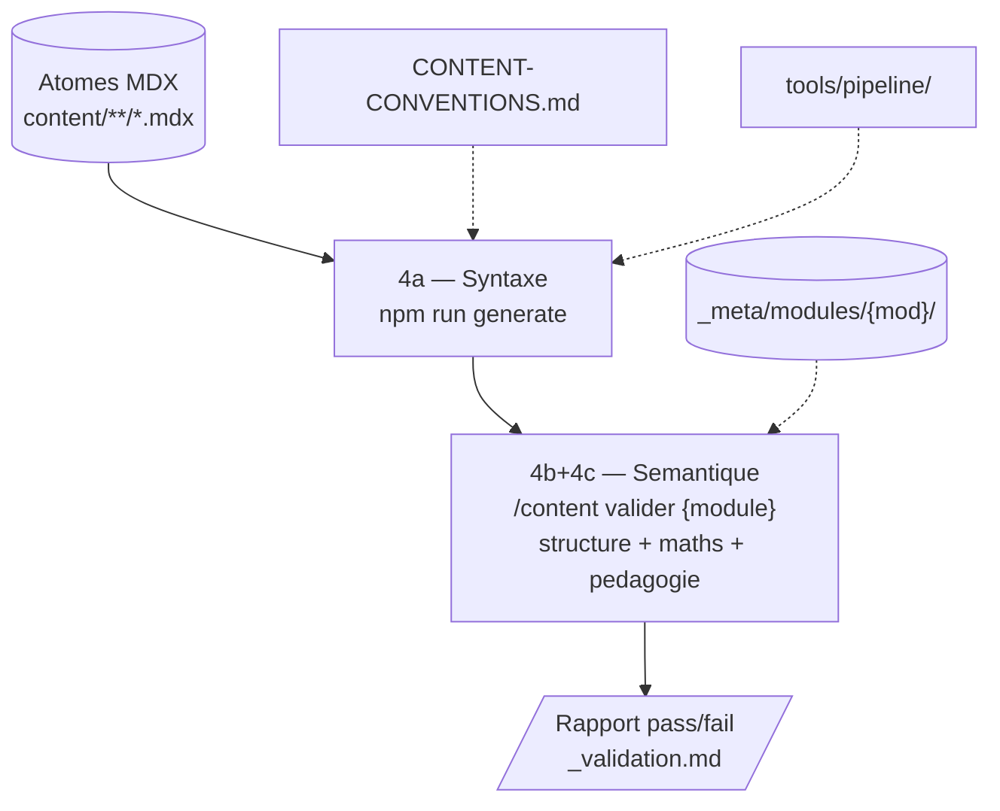
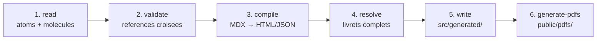

# Content Agentic Workflow

Document vivant qui cartographie le systeme de generation de contenu pedagogique pilote par LLM.

---

## Architecture

Le systeme repose sur 3 couches decouples :

```
_raw/          Ressources brutes (PDFs, transcriptions Typst)
               Input du systeme. Stable, rarement modifiee.

_meta/         Modele academique des mathematiques tunisiennes
               Savoir pur en YAML structure. Enrichissable independamment.
               Ne contient AUCUNE convention d'implementation (Typst, MDX).

content/       Systeme de production de livrets
               Plans (ephemeres) → atomes MDX + molecules YAML (produits finis).
               Les livrables ne dependent pas de _meta/ une fois generes.
```

**Principe de separation** : `_meta/` definit le QUOI (mathematiques), `content/` definit le COMMENT (implementation MDX/Typst). Les conventions d'implementation vivent dans `docs/` et `.claude/skills/`.

---

## Partie 1 : Inventaire des ressources

### Couche 1 — `_raw/` (ressources brutes)

| Ressource | Chemin | Role |
|-----------|--------|------|
| PDFs bruts | `_raw/*.pdf` | Sources PDF manuels tunisiens (8 PDFs) |
| Fiches sources | `_raw/sources/{slug}.yaml` | Cartographie structuree par PDF (1 fiche = 1 PDF) |
| References Typst | `_raw/reference/{prog}/{mod}/*.typ` | Transcriptions PDF → Typst (8 modules, 24 fichiers) |
| Pages PNG | `_raw/pages/` (gitignore) | Extractions visuelles a la demande (pdftoppm -r 150) |

### Couche 2 — `_meta/` (modele academique)

| Ressource | Chemin | Role | Format |
|-----------|--------|------|--------|
| Interface | `_meta/_interface.yaml` | Contrat IDs, schemas, conventions d'identifiants | YAML v2 |
| **Par module** | `_meta/modules/{mod}/` | 6 fichiers par module | |
| Savoir | `→ savoir.yaml` | Objectif, epistemic_level (admis/demontre/exclu), theoremes, concepts, KC | YAML structure |
| Praxeologies | `→ praxeologies.yaml` | TAD de Chevallard : tache, technique, technologie, theorie + didactic_variables, difficulty_profiles, exam_frequency | YAML structure |
| Patterns | `→ patterns.yaml` | Variantes d'exercices observees dans les examens (frequency, sources, examples) | YAML structure |
| Misconceptions | `→ misconceptions.yaml` | Erreurs frequentes avec category, diagnostic QCM (reveals), remediation (praxeology_to_practice) | YAML structure |
| Lexique | `→ lexique.yaml` | Notations, formules de redaction, regles de rigueur, longueurs type | YAML structure |
| Redaction | `→ redaction.yaml` | Modeles de redaction par praxeologie avec templates, variantes, criteres de notation ponderes | YAML structure |
| **Globaux** | `_meta/global/` | Cross-module | |
| Complexite | `→ complexite.yaml` | Echelle 0-3 avec criteres, correspondance types d'atomes | YAML |
| Lexique global | `→ lexique.yaml` | Vocabulaire partage, verbes d'action, conventions de demonstration | YAML |
| Prerequis | `→ prerequis-graph.yaml` | Graphe de dependances entre modules (ordre, trimestres) | YAML |
| **Examens** | `_meta/examens/` | Specs par examen | |
| Spec examen | `→ {slug}.yaml` | Structure, duree, distribution par module, patterns transversaux | YAML |

### Couche 3 — `content/` (production de livrets)

| Ressource | Chemin | Role |
|-----------|--------|------|
| Programme | `content/{prog}/_programme.yaml` | Metadata du programme (titre, description) |
| Atomes MDX | `content/{prog}/{mod}/{type}-{topic}-{slug}.mdx` | Contenus atomiques (lesson, exercise, qcm) |
| Molecules | `content/{prog}/{mod}/_molecules/{slug}/molecule.yaml` | Livrets assembles (kind: livret, sections → steps) |
| Plannings | `content/{prog}/{mod}/_molecules/{slug}/_planning.yaml` | Manifeste de generation (ephemere, status: draft→validated→generated) |
| Validations | `content/{prog}/{mod}/_molecules/{slug}/_validation.md` | Rapports de validation semantique |

### Outils et references (implementation)

| Ressource | Chemin | Role |
|-----------|--------|------|
| Skill /content | `.claude/skills/content/SKILL.md` | Routeur principal (kb, plan, creer, valider, patterns, lister) |
| Skill /transcription | `.claude/skills/transcription/SKILL.md` | Indexation et transcription PDF → Typst |
| Skill /source | `.claude/skills/source/SKILL.md` | Gestion sources pedagogiques web |
| KB template | `.claude/skills/content/references/kb-template.md` | Modele pour creer une KB module |
| Planning template | `.claude/skills/content/references/planning-template.yaml` | Schema du manifeste per-molecule |
| Patterns template | `.claude/skills/content/references/patterns-template.yaml` | Schema du fichier patterns |
| Templates atomes | `.claude/skills/content/references/templates.md` | Templates MDX par type (lesson, exercise, qcm, molecule) |
| Snippets Typst | `.claude/skills/content/references/typst-snippets.md` | Snippets vartable, cetz-plot, cetz |
| Conventions | `docs/CONTENT-CONVENTIONS.md` | Source de verite syntaxe + structure MDX/YAML |
| Referentiels | `docs/referentiels/` | Conventions redaction maths tunisiennes |
| Pipeline | `tools/pipeline/src/` | Compilation MDX → HTML/JSON + PDFs (6 stages) |

---

## Partie 2 : Workflows

### Vue globale



---

### WF0 — Indexer et transcrire les sources

Alimente le stock de references. Deux sous-etapes independantes.



**Entree** : fichier PDF brut
**Sortie 0a** : `_raw/sources/{slug}.yaml` (fiche d'indexation)
**Sortie 0b** : `_raw/reference/{programme}/{module}/*.typ` (transcription a la demande)

| Etape | Declencheur | Ressources chargees |
|-------|-------------|---------------------|
| 0a — Indexer un PDF | `/transcription index <pdf>` | PDF brut (table des matieres) |
| 0b — Transcrire un module | `/transcription {module}` | `_raw/sources/*.yaml` (plages de pages), PDFs source |

**Contraintes techniques** :
- Resolution 150 DPI (`-r 150`) pour garder les images sous 2000px
- Lecture visuelle des PNG (pas extraction de texte) — figures, tableaux, courbes
- Chunks de 5-8 pages max par appel API
- Toujours extraire Manuel + Corrige en parallele

---

### WF1 — Creer une KB module

Synthetise les transcriptions Typst en modele academique structure.

**Prerequis** : transcriptions `.typ` dans `_raw/reference/{prog}/{mod}/`. Si absentes → WF0b.



**Entree** : fichiers `.typ` pour le module (jusqu'a 3 sources)
**Sortie** : `_meta/modules/{module}/` — 5 fichiers YAML :

| Fichier | Contenu | Sections KB |
|---------|---------|-------------|
| `savoir.yaml` | Objectif, epistemic_level, transposition, prerequisites, concepts, theoremes, KC, exemples | 0-7 |
| `praxeologies.yaml` | TAD Chevallard : tache, technique, technologie, theorie + difficulty_profiles, exam_frequency | 8 |
| `misconceptions.yaml` | Erreurs avec category, diagnostic QCM, remediation liee aux praxeologies | 9 |
| `lexique.yaml` | Notations, formules de redaction, regles de rigueur, longueurs type | 10 |
| `redaction.yaml` | Modeles de redaction avec templates, variantes et criteres de notation | Nouveau |

| Declencheur | Ressources chargees |
|-------------|---------------------|
| `/content kb {module}` | kb-template.md, `_raw/reference/{prog}/{mod}/*.typ`, `docs/referentiels/` |

---

### WF1+ — Enrichir les patterns d'examen (iteratif)

Accumule des patterns d'exercices a partir de series, BAC, parascolaires. Peut etre appele N fois par module.

**Prerequis** : KB module existante dans `_meta/modules/{mod}/`.



**Entree** : exercices (Typst, MDX, texte, image) + KB module
**Sortie** : `_meta/modules/{module}/patterns.yaml` (cree ou enrichi)

| Declencheur | Ressources chargees |
|-------------|---------------------|
| `/content patterns {module}` | KB module (_meta/), patterns.yaml existant, exercices fournis |

**Regles** : 1 fichier par module, ne jamais modifier la KB, examples reels uniquement, IDs `PraxN.vM`.

---

### WF2 — Planifier un livret

Declare tous les atomes et la structure d'un livret AVANT generation.

**Prerequis** : KB module dans `_meta/modules/{mod}/`.



**Entree** : KB module + (optionnel) spec examen
**Sortie** : `content/{prog}/{mod}/_molecules/{slug}/_planning.yaml` avec `status: validated`

Le planning contient un champ `meta_refs` qui pointe vers `_meta/` :
```yaml
meta_refs:
  module: continuite           # → _meta/modules/continuite/
  # patterns: [Prax1.v1, ...]  # optionnel, pour livrets examen
  # examen: synthese-3eme-t3   # optionnel, pour livrets cross-module
```

**Cycle de vie** : `draft` → `validated` (review humain) → `generated` (apres WF3)

**Types de livrets possibles** :
- **Par module** : 3 livrets (cours diff 0-1, examen diff 1-2, exploration diff 2-3)
- **Cross-module** : prepa examen combinant plusieurs modules (via `meta_refs.examen`)
- **Libre** : toute combinaison de praxeologies et modules

| Declencheur | Ressources chargees |
|-------------|---------------------|
| `/content plan {module}` | KB module, planning-template.yaml |
| `/content plan {module} : {specs}` | idem, avec contraintes libres (nb molecules, difficulte, praxeologies) |

---

### WF3 — Generer le livret a partir du planning



**Entree** : `_planning.yaml` avec `status: validated`
**Sortie** : atomes MDX + molecules YAML dans `content/{prog}/{mod}/`

Le generateur :
1. Lit le planning et detecte les atomes deja generes (reprise possible)
2. Charge les references (_meta/, templates, conventions, snippets)
3. Genere chaque atome en suivant le champ `contenu` du planning comme spec
4. Assemble la molecule YAML (sections → steps, quiz blocks 2-5 QCM)
5. Passe le planning en `status: generated`

| Declencheur | Ressources chargees |
|-------------|---------------------|
| `/content creer {slug-molecule}` | planning, KB (_meta/), templates, typst-snippets, conventions |
| `/content creer section {label} {module}` | idem, filtre par section |
| `/content creer {type} {slug}` | templates, conventions (atome libre sans planning) |

---

### WF4 — Valider le contenu genere

Validation multi-paliers :



**Palier 4a — Pipeline** (`npm run generate`) : 6 phases internes



**Palier 4b+4c — Semantique** (`/content valider {module}`) : analyse LLM chaque atome selon 3 grilles (Structure, Maths, Pedagogie). Ecrit un rapport par molecule dans `_validation.md`.

| Declencheur | Ce qu'il fait |
|-------------|---------------|
| `npm run generate` | Compile MDX → HTML/JSON + PDFs. Valide references croisees. |
| `/content valider {module}` | Validation semantique complete (structure + maths + pedagogie) |
| `/content valider {fichier}` | Validation rapide d'un seul atome |

---

## Partie 3 : Structure des fichiers `_meta/` (YAML v2)

### `savoir.yaml` — Savoir structure

```yaml
module: continuite
programme: 3eme-math
version: 2.0
objective: "..."                    # 1 phrase

epistemic_level:
  theory_base: "analyse-reelle-elementaire"
  admitted: [{id, statement, justification}]     # Theoremes admis
  demonstrated: [{id, statement, proof_type}]    # Theoremes demontres
  excluded: ["..."]                              # Hors programme
  starting_point: ["..."]                        # Connaissances de depart

transposition:
  savoir_savant: ["..."]
  savoir_a_enseigner: ["..."]
  adaptations_didactiques: ["..."]

prerequisites: {required: [...], opens_toward: [...]}
concepts: [{id, name, sub_concepts: [...]}]      # N1, N1.1, N1.2...
theorems: [{id, type, name, statement, status, proof_type, concepts, used_in}]
facts: [{id, content}]
skills: [{id, description, concepts, difficulty, praxeology}]
principles: [{id, content}]
canonical_examples: [{id, description, illustrates, concepts, difficulty}]
```

### `praxeologies.yaml` — TAD de Chevallard enrichi

```yaml
praxeologies:
  - id: Prax1
    name: "..."
    concepts: [N2]
    difficulty: 1                     # 0-3
    exam_frequency: medium            # low, medium, high, very_high

    task_type: "..."                  # T — type de tache
    technique: "..."                  # tau — methode pas a pas
    technology: "..."                 # theta — justification theorique
    theory: "..."                     # Theta — cadre theorique

    didactic_variables:               # Ce qui fait varier la difficulte
      - name: type_de_fonction
        values: [polynome, rationnelle, irrationnelle]
        effect: "+1 par niveau de complexite"

    difficulty_profiles:              # Combinaisons → niveau
      0: {type_de_fonction: polynome, complexite: simple}
      1: {type_de_fonction: rationnelle, complexite: simple}
      2: {type_de_fonction: irrationnelle, complexite: composee}

    common_errors: [E1, E3]           # Liens vers misconceptions
    canonical_examples: ["..."]
```

### `misconceptions.yaml` — Erreurs avec diagnostic

```yaml
misconceptions:
  - id: E1
    name: "..."
    category: confusion               # confusion, sur-generalisation, oubli, erreur-technique
    frequency: frequente               # occasionnelle, frequente, tres_frequente
    description: "..."
    source_cognitive: "..."
    diagnostic:
      question: "..."
      options:
        - {label: "...", reveals: "...", correct: false}
        - {label: "...", reveals: null, correct: true}
    remediation:
      explanation: "..."
      counter_example: "..."
      praxeology_to_practice: Prax3    # Lien vers la praxeologie a travailler
```

### `redaction.yaml` — Modeles de redaction (nouveau)

```yaml
redaction_models:
  - praxeology: Prax4
    name: "Application du TVI"
    template: >-
      $f$ est {type_continuite}, donc continue sur $[{a}, {b}]$.
      $f({a}) = {val_a}$ et $f({b}) = {val_b}$.
      $f({a}) \times f({b}) < 0$.
      Par le TVI, $f(x) = 0$ admet au moins une solution dans $]{a}, {b}[$.
    expected_lines: {min: 4, typical: 5, max: 6}
    grading_criteria:
      - {criterion: "Justification de la continuite", weight: 0.3, required: true}
      - {criterion: "Calcul correct de f(a) et f(b)", weight: 0.3, required: true}
      - {criterion: "Produit f(a)*f(b) < 0", weight: 0.2, required: true}
      - {criterion: "Conclusion par le TVI", weight: 0.2, required: true}
```

### `_interface.yaml` — Contrat

Definit les schemas, les modules declares, les specs d'examen, et les conventions d'identifiants (`Prax{N}`, `T{N}`, `N{N}`, `E{N}`, `S{N}`, `F{N}`, `EC{N}`).

---

## Partie 4 : Commandes

| Commande | Workflow | Ce qu'elle fait |
|----------|----------|-----------------|
| `/transcription index <pdf>` | WF0a | Indexer un PDF, creer la fiche source |
| `/transcription {module}` | WF0b | Transcrire un module en Typst |
| `/content kb {module}` | WF1 | Creer les 5 fichiers YAML dans `_meta/modules/` |
| `/content patterns {module}` | WF1+ | Enrichir patterns.yaml avec des exercices |
| `/content plan {module}` | WF2 | Generer le(s) planning(s) d'un livret |
| `/content plan {module} : {specs}` | WF2 | idem avec contraintes (difficulte, nb molecules, praxeologies) |
| `/content creer {slug-molecule}` | WF3 | Generer les atomes + molecule depuis le planning |
| `npm run generate` | WF4a | Compiler MDX → HTML/JSON + PDFs |
| `/content valider {module}` | WF4b+c | Validation semantique complete |
| `/content lister {query}` | — | Inventaire (atomes, molecules, orphelins) |

---

## Partie 5 : Etat actuel

> Mis a jour le 2026-03-22.

| Metrique | Valeur |
|----------|--------|
| Programmes | 3 declares (3eme-math, 1ere-tc, 2nde-math), 1 avec contenu |
| Modules avec contenu | 4 (continuite, denombrement, fonction-derivee, nombre-derive) |
| Atomes MDX | 218 |
| Livrets YAML | 12 (3 par module : cours, examen, exploration) |
| KB modules (_meta/) | 4 (6 fichiers YAML chacun) |
| Patterns | 1 (nombre-derive, 30+ patterns documentes) |
| Specs examen | 1 (synthese-3eme-t3) |
| Fichiers _meta/ globaux | 3 (complexite, lexique, prerequis-graph) |
| Fiches sources (_raw/) | 8 (tous les PDFs 3eme-math indexes) |
| References Typst | 8 modules transcrits (24 fichiers .typ) |
| Plannings | 12 per-molecule (3 par module) |
| Pipeline | 0 erreurs, 12 PDFs generes |

### Modules sans contenu mais avec transcriptions

4 modules transcrits et prets pour WF1 :
- `generalites-fonctions`
- `limites-comportements-asymptotiques`
- `limites-continuite`
- `exemples-etude-fonctions`

---

## Partie 6 : Lacunes et evolutions

| # | Lacune | Workflow | Priorite |
|---|--------|----------|----------|
| L1 | Pas de patterns pour 3 modules (continuite, fonction-derivee, denombrement) | WF1+ | moyenne |
| L2 | Pas de verification automatique planning → atomes generes (slugs du planning vs fichiers .mdx) | WF4 | basse |
| L3 | Pas d'export lisible de `_meta/` pour review par des profs (YAML difficile a lire pour un non-tech) | WF1 | haute |
| L4 | Pas de livret cross-module (l'architecture le permet, mais aucun n'a ete cree) | WF2 | moyenne |
| L5 | `_resources/` contient des artefacts obsoletes (serie ad-hoc d'avant le systeme structure) | — | basse |
