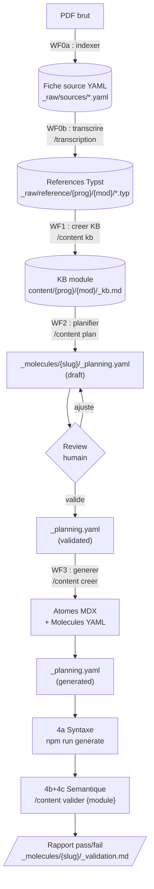
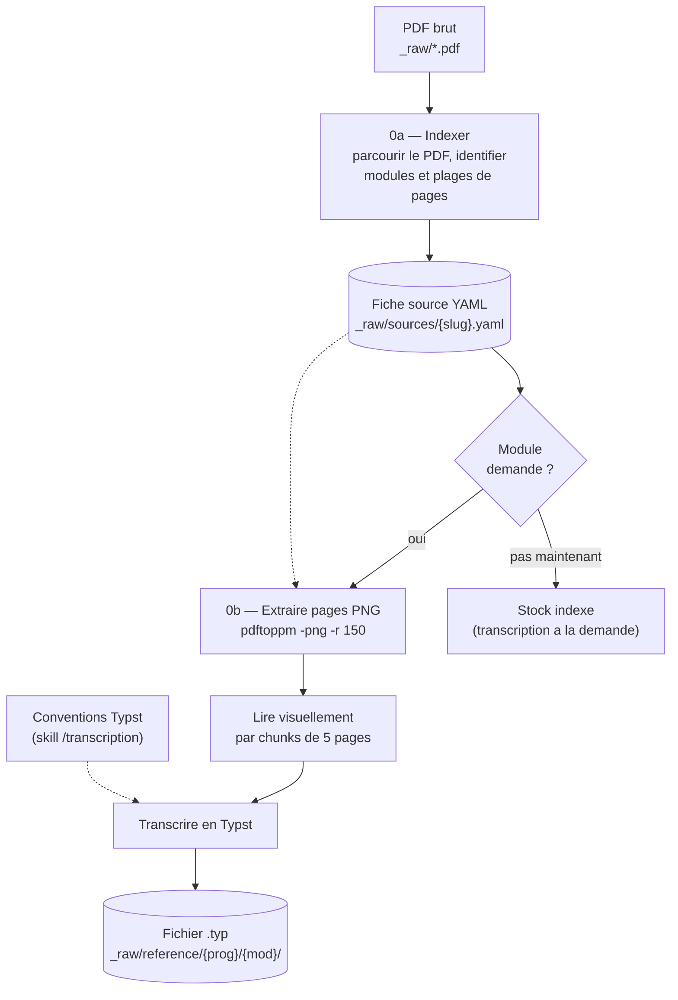
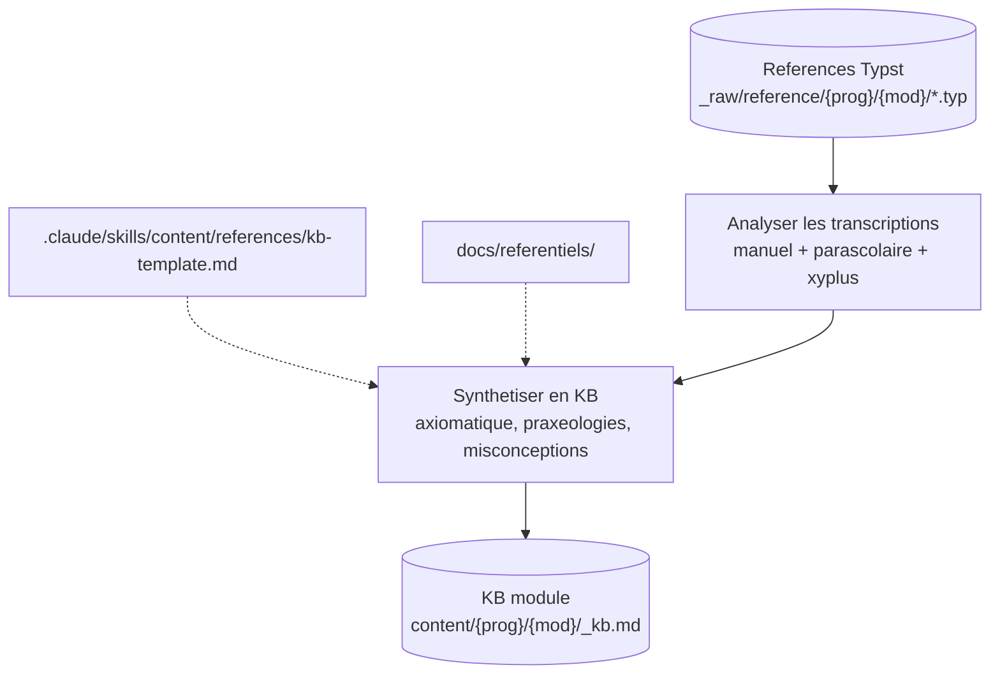
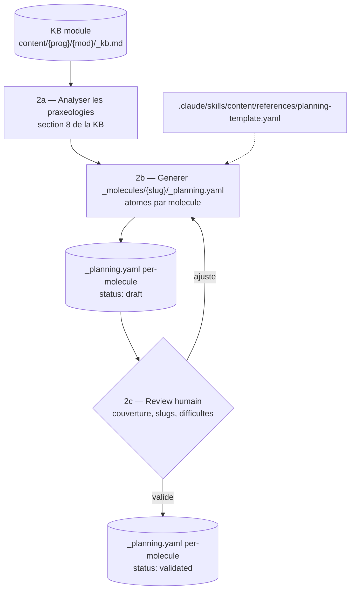
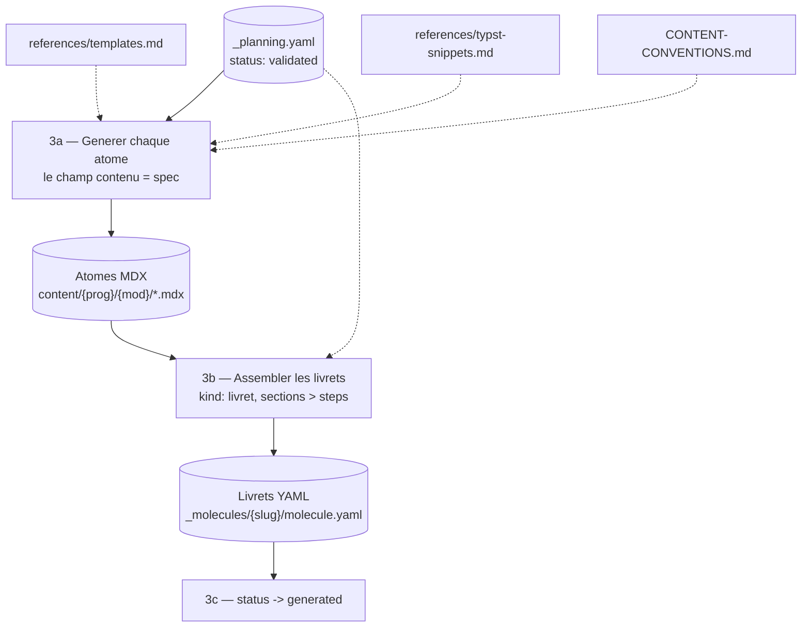
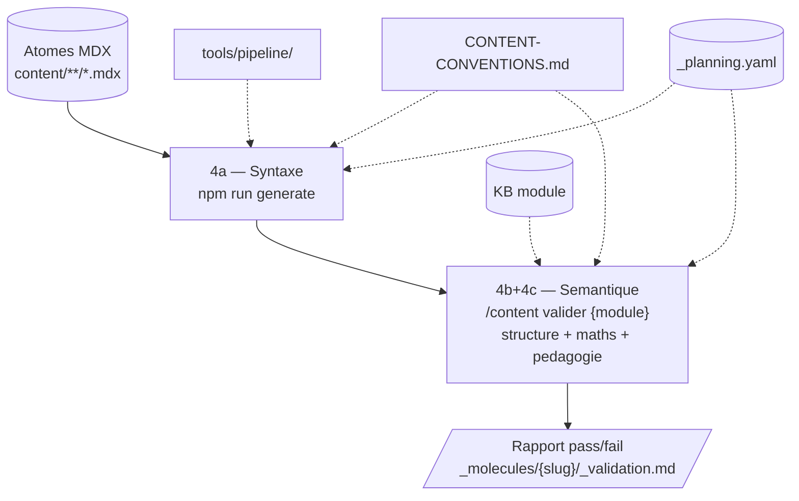
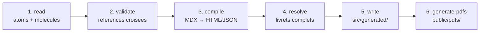

# Content Agentic Workflow

Document vivant qui cartographie le systeme de contenu pilote par LLM.

---

## Partie 1 : Inventaire des ressources

| Ressource | Chemin | Role | Utilise dans |
|-----------|--------|------|--------------|
| **--- Indexation & transcription (WF0) ---** | | | |
| PDFs bruts | `_raw/*.pdf` | Sources PDF manuels tunisiens | WF0 [0a] — entree indexation |
| Fiches sources | `_raw/sources/{slug}.yaml` | Cartographie structuree par PDF (1 fiche = 1 PDF) | WF0 [0a] — sortie ; WF0 [0b] — plages de pages |
| Skill /transcription | `.claude/skills/transcription/SKILL.md` | Transcription PDF -> Typst | WF0 [0b] — declencheur transcription |
| Skill /source | `.claude/skills/source/SKILL.md` | Gestion sources pedagogiques web | pre-WF0 — veille et scan de sources |
| Sources web | `docs/content-intelligence/sources/registry.md` | Registre de sources pedagogiques | pre-WF0 — reference lors de la recherche |
| References Typst | `_raw/reference/{programme}/{module}/` | Transcriptions PDF -> Typst | WF0 [0b] — sortie ; WF1 — entree |
| **--- Knowledge Base (WF1) ---** | | | |
| Referentiels | `docs/referentiels/` | Conventions redaction maths tunisiennes | WF1 — reference KB ; WF3 [3a] — reference generation |
| KB template | `.claude/skills/content/references/kb-template.md` | Modele pour creer une KB module | WF1 — template de creation |
| KB modules | `content/{prog}/{mod}/_kb.md` | Savoir structure par module (2 existants) | WF1 — sortie ; WF2 [2a] — entree analyse praxeologies |
| **--- Planning (WF2) ---** | | | |
| Planning template | `.claude/skills/content/references/planning-template.yaml` | Schema du manifeste per-molecule | WF2 [2b] — template de creation |
| Planning per-molecule | `content/{prog}/{mod}/_molecules/{slug}/_planning.yaml` | Manifeste par molecule (avant generation) | WF2 — sortie ; WF3 [3a] — spec de generation ; WF4 [4a] — verification couverture |
| **--- Generation (WF3) ---** | | | |
| Templates atomes | `.claude/skills/content/references/templates.md` | Templates copier-coller par type | WF3 [3a] — structure MDX de chaque atome |
| Snippets Typst | `.claude/skills/content/references/typst-snippets.md` | Snippets vartable, cetz-plot, cetz | WF3 [3a] — graphiques et tableaux de variation |
| Conventions | `docs/CONTENT-CONVENTIONS.md` | Source de verite syntaxe + structure | WF3 [3a] — reference nommage ; WF4 [4a] — reference validation |
| **--- Validation (WF4) ---** | | | |
| Pipeline | `tools/pipeline/` | Compilation MDX -> HTML/JSON + PDFs | WF4 [4a] — `npm run generate` compilation + validation |
| Validation refs | `tools/pipeline/src/stages/validate.ts` | Integrite molecules -> atomes (integre au pipeline) | WF4 [4a] — verification references croisees |
| **--- Transversal ---** | | | |
| Skill /content | `.claude/skills/content/SKILL.md` | Routeur workflow contenu | WF1 — `/content kb` ; WF2 — `/content plan` ; WF3 — `/content creer` ; WF4 — `/content valider` |

---

## Partie 2 : Workflows

### Vue globale



---

### WF0 -- Indexer & transcrire les sources

Workflow d'alimentation du stock de references. Deux sous-etapes independantes.



Entree : fichier PDF brut
Sortie 0a : `_raw/sources/{slug}.yaml` (fiche d'indexation)
Sortie 0b : `_raw/reference/{programme}/{module}/*.typ` (transcription a la demande)

#### Declencheurs

| Etape | Declencheur | Ressources chargees |
|-------|-------------|---------------------|
| 0a — Indexer un PDF | `/transcription index <pdf>` | PDF brut (table des matieres) |
| 0b — Transcrire un module | `/transcription {module}` | `_raw/sources/*.yaml` (plages de pages), PDFs source |

#### Exemples de prompts

```
/transcription index Parascolaire_Analyse_3eme_sec_Section_Math_ocr.pdf
```

```
/transcription continuite
```

---

### WF1 -- Creer une KB module

Prerequis : les transcriptions .typ du module doivent exister dans `_raw/reference/`. Si elles manquent, retourner au WF0b.



Entree : fichiers .typ existants pour le module
Sortie : `content/{programme}/{module}/_kb.md`

#### Declencheurs

| Etape | Declencheur | Ressources chargees |
|-------|-------------|---------------------|
| Creer la KB | `/content kb {module}` | `.claude/skills/content/references/kb-template.md`, `_raw/reference/{prog}/{mod}/*.typ`, `docs/referentiels/` |

#### Exemples de prompts

```
/content kb continuite
```

```
/content kb fonction-derivee
```

---

### WF2 -- Planifier un livret



Entree : KB module complete (`content/{programme}/{module}/_kb.md`)
Sortie : `content/{programme}/{module}/_molecules/{slug}/_planning.yaml` avec `status: validated` (1 fichier par molecule)

**Cycle de vie du status** : `draft` → `validated` (review humain) → `generated` (apres WF3)

#### Declencheurs

| Etape | Declencheur | Ressources chargees |
|-------|-------------|---------------------|
| Generer le planning | `/content plan {module}` | KB module (`_kb.md`), `.claude/skills/content/references/planning-template.yaml` |
| Review humain | manuel (lecture du YAML) | — |
| Valider le planning | prompt libre | `_planning.yaml` |

#### Exemples de prompts

```
/content plan continuite
```

```
Le planning est bon, passe le status a validated
```

#### Lacunes identifiees

- ~~Workflow nouveau, jamais execute en conditions reelles~~ — resolu (2 plannings executes avec succes)
- Pas de validation automatique du planning (couverture praxeologies, slugs conformes)

---

### WF3 -- Generer le livret a partir du planning



Chaque molecule generee utilise `kind: livret` avec des sections (pas de distinction cours/serie).

Entree : `_planning.yaml` avec `status: validated`
Sortie : atomes MDX + molecules YAML (`_molecules/{slug}/molecule.yaml`) dans `content/{programme}/{module}/`

#### Declencheurs

| Etape | Declencheur | Ressources chargees |
|-------|-------------|---------------------|
| Generer depuis le planning | `/content creer {module}` | `_planning.yaml`, KB, templates, typst-snippets, conventions |
| Generer une section | `/content creer section {label} {module}` | idem, filtre par section |
| Generer un atome libre | `/content creer {type} {slug}` | templates, conventions |
| Compiler le resultat | `npm run generate` | `tools/pipeline/` |

#### Exemples de prompts

```
/content creer les atomes du module continuite selon le planning
```

```
Genere tous les atomes de la section "Definition et continuite en un point"
du planning continuite
```

#### Lacunes identifiees

- ~~Le skill `/content creer` ne sait pas encore lire `_planning.yaml` comme source~~ — resolu
- Pas d'orchestration multi-atomes — **partiellement resolu** (progression par Glob, reprise possible)
- Le suivi de progression est manuel (pas de fichier de tracking automatique)

---

### WF4 -- Valider le contenu genere

Validation multi-paliers du contenu genere (ou existant) :



Le palier 4a (`npm run generate`) execute 6 phases internes :



Entree : atomes MDX (generes ou existants)
Sortie : rapport de validation par palier

#### Declencheurs

| Etape | Declencheur | Ressources chargees |
|-------|-------------|---------------------|
| 4a — Pipeline | `npm run generate` | `tools/pipeline/` (read, validate, compile, resolve, write) |
| 4a — References | integre dans `npm run generate` (validate.ts) | Molecules + atomes |
| 4a — Conventions | `/content valider {fichier}` | `docs/CONTENT-CONVENTIONS.md` |
| 4b+4c — Semantique | `/content valider {module}` | `CONTENT-CONVENTIONS.md`, KB, planning, templates |

#### Exemples de prompts

```
npm run generate
```

```
/content valider les atomes du module continuite
```

```
# Futur — palier maths (pas encore implemente)
Verifie les mathematiques de tous les exercices du module continuite :
formules, calculs, solutions
```

#### Lacunes identifiees

- ~~Palier 4b (maths) : aucun outil~~ — resolu (`/content valider {module}`, Grille B)
- ~~Palier 4c (pedagogie) : aucun outil~~ — resolu (`/content valider {module}`, Grille C)
- ~~Pas de rapport structure~~ — resolu (rapport par molecule dans `content/{prog}/{mod}/_molecules/{slug}/_validation.md`)
- Pas de conformite planning -> atomes generes (verifier que tous les slugs du planning existent)

---

## Partie 3 : Etat actuel

| Metrique | Valeur |
|----------|--------|
| Programmes | 3 declares (3eme-math, 1ere-tc, 2nde-math), 1 avec contenu |
| Modules avec contenu | 5 (continuite, derivation, fonctions, fonction-derivee, fonction-derivee-usuelle) |
| Atomes MDX | 222 |
| Livrets YAML | 20 (kind: livret unifie, plus de distinction cours/serie) |
| KB modules | 2 (fonctions, fonction-derivee) |
| Fiches sources | 8 (tous les PDFs 3eme-math indexes) |
| References Typst | 7 modules transcrits (21 fichiers .typ) |
| Plannings | 6 per-molecule (3 fonction-derivee + 3 fonction-derivee-usuelle) |

---

## Partie 4 : Synthese des lacunes

| # | Lacune | Workflows impactes | Priorite |
|---|--------|--------------------|----------|
| ~~L1~~ | ~~Pas de skill dedie pour l'indexation de PDF (WF0a)~~ | ~~WF0~~ | resolue |
| ~~L2~~ | ~~Planning jamais teste en conditions reelles~~ | ~~WF2~~ | resolue (2 plannings executes) |
| ~~L3~~ | ~~`/content creer` ne lit pas `_planning.yaml` comme source~~ | ~~WF3~~ | resolue |
| L4 | Pas d'orchestration multi-atomes (reprise, progression) — partiellement resolu (progression par Glob) | WF3 | moyenne |
| ~~L5~~ | ~~Paliers validation maths + pedagogie inexistants~~ | ~~WF4~~ | resolue (`/content valider {module}`) |
| L6 | Pas de verification automatique planning -> atomes generes | WF4 | basse |
