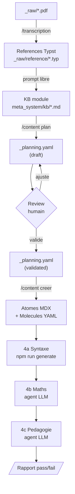
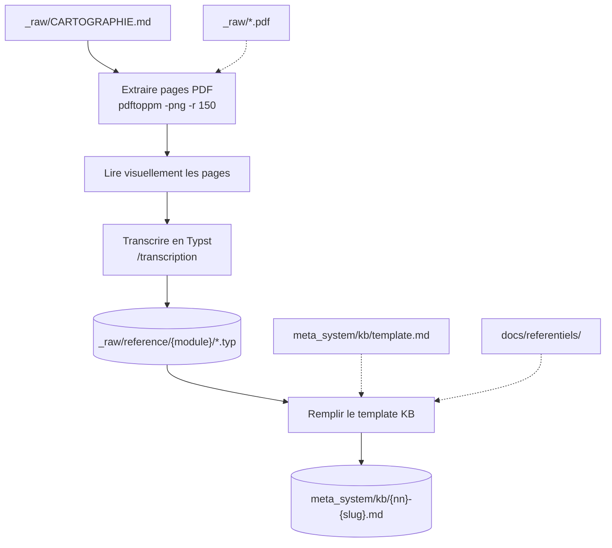
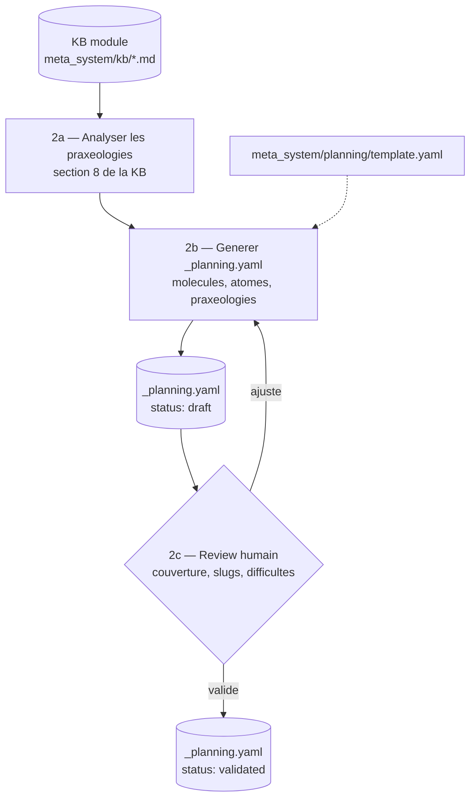
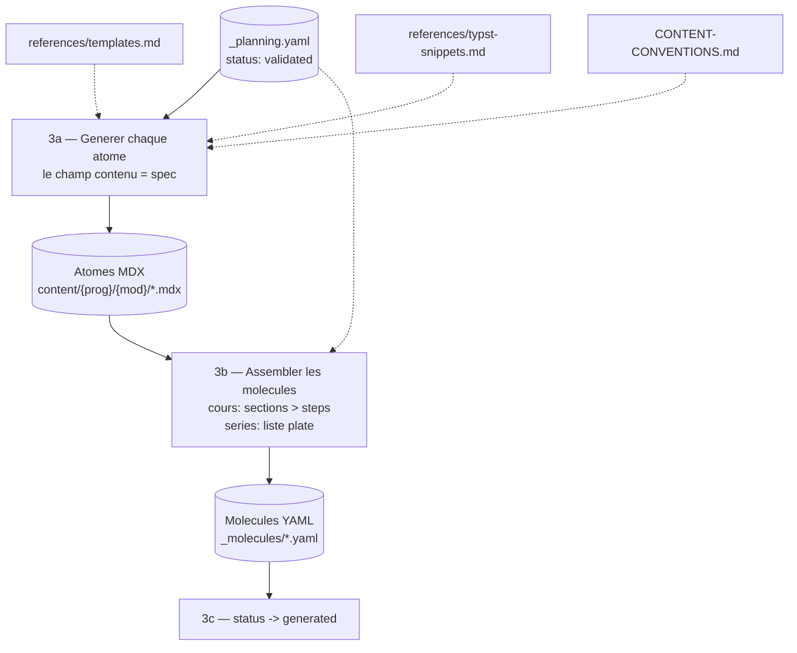
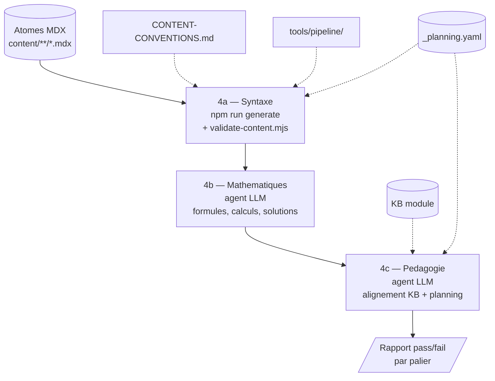

# Content Agentic Workflow

Document vivant qui cartographie le systeme de contenu pilote par LLM.

---

## Partie 1 : Inventaire des ressources

| Ressource | Chemin | Role | Utilise dans |
|-----------|--------|------|--------------|
| **--- Sources & extraction ---** | | | |
| PDFs bruts | `_raw/` + `_raw/CARTOGRAPHIE.md` | Sources PDF manuels tunisiens | WF1 — entree, extraction pages |
| Skill /transcription | `.claude/skills/transcription/SKILL.md` | Transcription PDF -> Typst | WF1 — declencheur transcription |
| Skill /source | `.claude/skills/source/SKILL.md` | Gestion sources pedagogiques web | pre-WF1 — veille et scan de sources |
| Sources web | `docs/content-intelligence/sources/registry.md` | Registre de sources pedagogiques | pre-WF1 — reference lors de la recherche |
| References Typst | `_raw/reference/{module}/` | Transcriptions PDF -> Typst | WF1 — sortie transcription, entree KB |
| Referentiels | `docs/referentiels/` | Conventions redaction maths tunisiennes | WF1 — reference KB ; WF3 [3a] — reference generation |
| **--- Knowledge Base ---** | | | |
| KB template | `meta_system/kb/template.md` | Modele pour creer une KB module | WF1 — template de creation |
| KB modules | `meta_system/kb/{nn}-{slug}.md` | Savoir structure par module (1 existant) | WF1 — sortie ; WF2 [2a] — entree analyse praxeologies |
| **--- Planning ---** | | | |
| Planning template | `meta_system/planning/template.yaml` | Schema du manifeste de livret | WF2 [2b] — template de creation |
| Planning modules | `content/{prog}/{mod}/_planning.yaml` | Manifeste par module (avant generation) | WF2 — sortie ; WF3 [3a] — spec de generation ; WF4 [4a] — verification couverture |
| **--- Generation ---** | | | |
| Templates atomes | `.claude/skills/content/references/templates.md` | Templates copier-coller par type | WF3 [3a] — structure MDX de chaque atome |
| Snippets Typst | `.claude/skills/content/references/typst-snippets.md` | Snippets vartable, cetz-plot, cetz | WF3 [3a] — graphiques et tableaux de variation |
| Conventions | `docs/CONTENT-CONVENTIONS.md` | Source de verite syntaxe + structure | WF3 [3a] — reference nommage ; WF4 [4a] — reference validation |
| **--- Validation ---** | | | |
| Pipeline | `tools/pipeline/` | Compilation MDX -> HTML/JSON + PDFs | WF4 [4a] — `npm run generate` compilation + validation |
| Validation refs | `scripts/validate-content.mjs` | Integrite molecules -> atomes | WF4 [4a] — verification references croisees |
| **--- Transversal ---** | | | |
| Skill /content | `.claude/skills/content/SKILL.md` | Routeur workflow contenu | WF2 — `/content plan` ; WF3 — `/content creer` ; WF4 — `/content valider` |

---

## Partie 2 : Workflows

### Vue globale



---

### WF1 -- Creer une KB module



Entree : identifiant module dans CARTOGRAPHIE.md
Sortie : `meta_system/kb/{nn}-{slug}.md`

#### Declencheurs

| Etape | Declencheur | Ressources chargees |
|-------|-------------|---------------------|
| Transcrire les PDFs | `/transcription {module}` | `_raw/CARTOGRAPHIE.md`, PDFs source |
| Creer la KB | prompt libre | `meta_system/kb/template.md`, `_raw/reference/{module}/*.typ` |

#### Exemples de prompts

```
/transcription continuite
```

```
Cree la KB du module continuite a partir des transcriptions Typst
dans _raw/reference/02-continuite/
```

#### Lacunes identifiees

- Pas de skill dedie pour la creation de KB (la transcription et la KB sont deux etapes distinctes mais seule la transcription a un skill)

---

### WF2 -- Planifier un livret



Entree : KB module complete (`meta_system/kb/{nn}-{slug}.md`)
Sortie : `content/{programme}/{module}/_planning.yaml` avec `status: validated`

#### Declencheurs

| Etape | Declencheur | Ressources chargees |
|-------|-------------|---------------------|
| Generer le planning | `/content plan {module}` | KB module, `meta_system/planning/template.yaml` |
| Review humain | manuel (lecture du YAML) | — |
| Valider le planning | prompt libre | `_planning.yaml` |

#### Exemples de prompts

```
/content plan continuite
```

```
Le planning est bon, passe le status a validated
```

#### Lacunes identifiees

- Workflow nouveau, jamais execute en conditions reelles
- Pas de validation automatique du planning (couverture praxeologies, slugs conformes)

---

### WF3 -- Generer le livret a partir du planning



Entree : `_planning.yaml` avec `status: validated`
Sortie : atomes MDX + molecules YAML dans `content/{programme}/{module}/`

#### Declencheurs

| Etape | Declencheur | Ressources chargees |
|-------|-------------|---------------------|
| Generer un atome | `/content creer {type} {module}` | `_planning.yaml`, `references/templates.md`, `references/typst-snippets.md` |
| Generer tout le livret | prompt libre | idem + orchestration manuelle |
| Compiler le resultat | `npm run generate` | `tools/pipeline/` |

#### Exemples de prompts

```
/content creer les atomes du module continuite selon le planning
```

```
Genere tous les atomes de la section "Definition et continuite en un point"
du planning continuite
```

#### Lacunes identifiees

- Pas d'orchestration multi-atomes : le LLM genere atome par atome dans une seule conversation, sans reprise possible si interruption
- Pas de suivi de progression (quels atomes du planning sont deja generes, lesquels restent)
- Le skill `/content creer` ne sait pas encore lire `_planning.yaml` comme source

---

### WF4 -- Valider le contenu genere

Validation multi-paliers du contenu genere (ou existant) :



Entree : atomes MDX (generes ou existants)
Sortie : rapport de validation par palier

#### Declencheurs

| Etape | Declencheur | Ressources chargees |
|-------|-------------|---------------------|
| 4a — Pipeline | `npm run generate` | `tools/pipeline/` (read, validate, compile, resolve, write) |
| 4a — References | `node scripts/validate-content.mjs` | Molecules + atomes |
| 4a — Conventions | `/content valider {module}` | `docs/CONTENT-CONVENTIONS.md` |
| 4b — Maths | **inexistant** | — |
| 4c — Pedagogie | **inexistant** | — |

#### Exemples de prompts

```
npm run generate
```

```
/content valider les atomes du module continuite
```

```
# Futur — palier maths (pas encore implemente)
Verifie les mathematiques de tous les exercices du module continuite :
formules, calculs, solutions
```

#### Lacunes identifiees

- Palier 4b (maths) : aucun outil — necessite un agent LLM avec checklist dediee
- Palier 4c (pedagogie) : aucun outil — necessite un agent LLM avec acces a la KB et au planning
- Pas de rapport structure (les erreurs sont dans le stdout de npm run generate, pas dans un fichier exploitable)
- Pas de conformite planning -> atomes generes (verifier que tous les slugs du planning existent)

---

## Partie 3 : Etat actuel

| Metrique | Valeur |
|----------|--------|
| Programmes | 3 declares (3eme-math, 1ere-tc, 2nde-math), 1 avec contenu |
| Modules avec contenu | 3 (continuite, derivation, fonctions) |
| Atomes MDX | 185 (continuite: 95, fonctions: 64, derivation: 26) |
| Molecules YAML | 14 (continuite: 7, fonctions: 4, derivation: 3) |
| KB modules | 1/23 (generalites-fonctions) |
| References Typst | 7 modules transcrits (21 fichiers .typ) |
| Plannings | 0 (workflow defini, pas encore execute) |

---

## Partie 4 : Synthese des lacunes

| # | Lacune | Workflows impactes | Priorite |
|---|--------|--------------------|----------|
| L1 | Pas de skill dedie pour creer une KB (distinct de `/transcription`) | WF1 | basse |
| L2 | Planning jamais teste en conditions reelles | WF2 | **haute** |
| L3 | `/content creer` ne lit pas `_planning.yaml` comme source | WF3 | **haute** |
| L4 | Pas d'orchestration multi-atomes (reprise, progression) | WF3 | moyenne |
| L5 | Paliers validation maths + pedagogie inexistants | WF4 | moyenne |
| L6 | Pas de verification automatique planning -> atomes generes | WF4 | basse |
