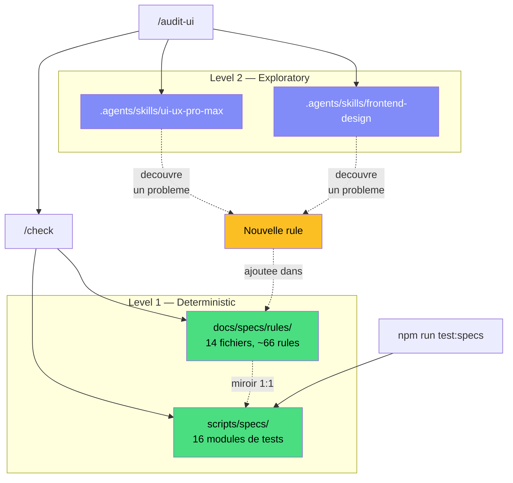
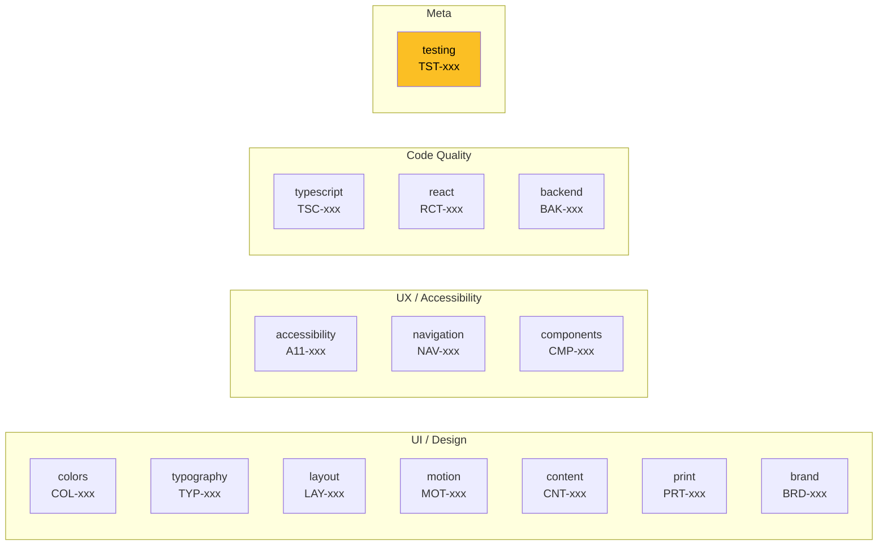
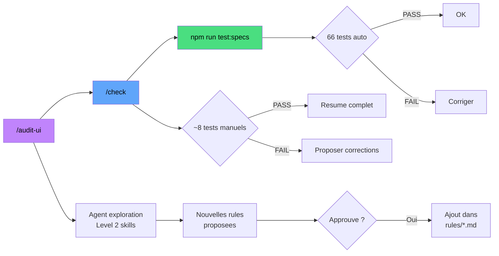
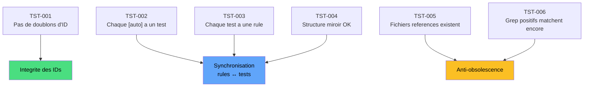
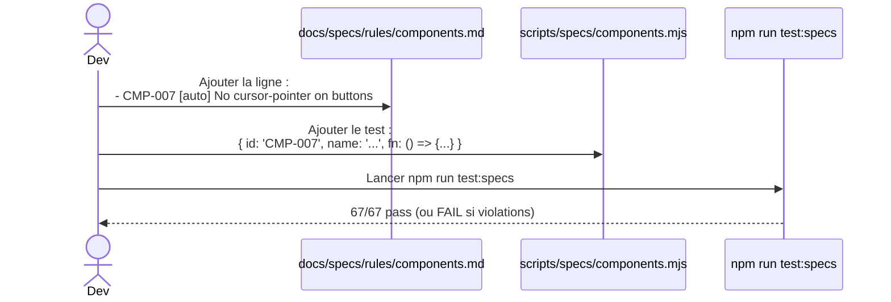
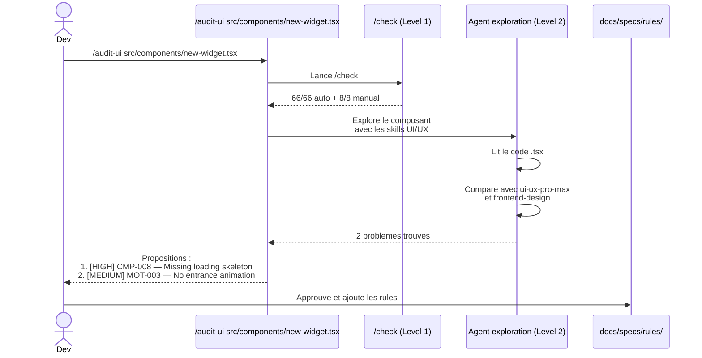
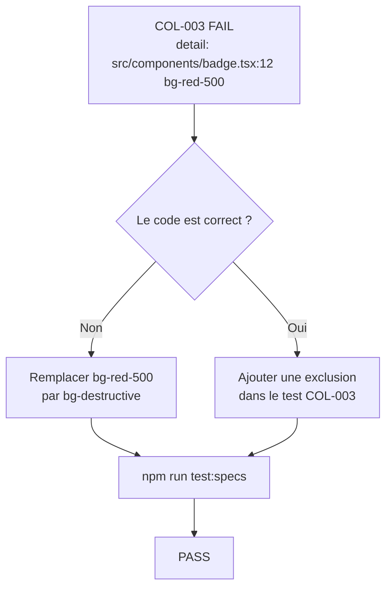
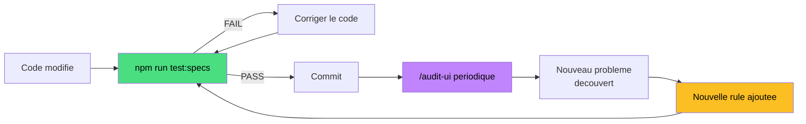

# Spec Framework — Guide d'utilisation

## Vue d'ensemble

Le Spec Framework est un systeme de garde-fous a deux niveaux pour garantir la qualite du code et du design.



**Principe** : Level 2 decouvre des problemes, les transforme en rules Level 1, et on ne regresse plus jamais.

---

## Level 1 — Rules deterministes

Chaque rule est une assertion binaire (PASS / FAIL) sur le code.

### Format d'une rule

```markdown
- COL-001 [auto] Light mode : :root definit --primary, --secondary, --success en oklch()
- COL-004 [manual] Contraste WCAG AA 4.5:1 sur tous les textes
  > Procedure : inspection visuelle avec DevTools ou extension axe
```

| Tag | Signification | Verification |
|-----|--------------|--------------|
| `[auto]` | Test automatise en Node.js | `npm run test:specs` |
| `[manual]` | Verification par Claude (lecture seule) | `/check` |

### Les 14 domaines



### Structure miroir

Chaque fichier de rules a un fichier de tests correspondant :

```
docs/specs/rules/         scripts/specs/
├── colors.md        ←→   ├── colors.mjs
├── typography.md    ←→   ├── typography.mjs
├── layout.md        ←→   ├── layout.mjs
├── accessibility.md ←→   ├── accessibility.mjs
├── navigation.md    ←→   ├── navigation.mjs
├── components.md    ←→   ├── components.mjs
├── motion.md        ←→   ├── motion.mjs
├── content.md       ←→   ├── content.mjs
├── print.md         ←→   ├── print.mjs
├── brand.md         ←→   ├── brand.mjs
├── typescript.md    ←→   ├── typescript.mjs
├── react.md         ←→   ├── react.mjs
├── backend.md       ←→   ├── backend.mjs
└── testing.md       ←→   ├── testing.mjs
                           ├── runner.mjs    (orchestrateur)
                           └── helpers.mjs   (utilitaires)
```

La correspondance miroir est elle-meme verifiee par **TST-004**.

---

## Level 2 — Exploration

Les skills servent de **references** pour decouvrir de nouveaux problemes lors d'un audit :

| Skill | Role |
|-------|------|
| `ui-ux-pro-max` | Guidelines UX, accessibilite, animation |
| `frontend-design` | Design creatif, typographie, couleurs |

Level 2 ne contient **aucune rule**. Son role est de **nourrir** Level 1.

---

## Les 3 commandes



| Commande | Quand l'utiliser | Duree |
|----------|-----------------|-------|
| `npm run test:specs` | Apres chaque modification de code | ~2 sec |
| `/check` | Avant un commit ou une PR | ~1 min |
| `/audit-ui` | Review periodique ou nouveau composant | ~5 min |

---

## Meta-tests (TST-xxx)

Le framework se surveille lui-meme avec 6 meta-rules :



Si tu ajoutes une rule `[auto]` sans test → **TST-002 echoue**.
Si tu ajoutes un test sans rule → **TST-003 echoue**.
Si tu supprimes un fichier reference par un test → **TST-005 echoue**.

---

## Use cases

### 1. Ajouter une rule automatisee

> *"Je veux interdire `cursor: pointer` sur les `<button>` (les navigateurs le font deja)"*



**Etapes concretes :**

1. Ouvrir `docs/specs/rules/components.md`, ajouter :
   ```markdown
   - CMP-007 [auto] No cursor-pointer on native button elements
   ```

2. Ouvrir `scripts/specs/components.mjs`, ajouter dans le tableau `tests` :
   ```javascript
   {
     id: 'CMP-007',
     name: 'No cursor-pointer on buttons',
     fn: () => {
       const hits = grepFiles(tsxFiles, /cursor-pointer/)
         .filter(m => /* logique de filtrage */)
       return {
         pass: hits.length === 0,
         detail: hits.length ? hits.map(h => `${h.file}:${h.line}`).join(', ') : 'OK'
       }
     }
   }
   ```

3. Lancer `npm run test:specs` pour verifier.

---

### 2. Ajouter une rule manuelle

> *"Je veux verifier que le logo est visible en mode sombre"*

**Une seule etape** — ouvrir `docs/specs/rules/brand.md`, ajouter :

```markdown
- BRD-006 [manual] Logo visible et lisible en dark mode
  > Procedure : basculer en dark mode, verifier le logo dans le sidebar et la page d'accueil
```

Pas de fichier test a modifier. La verification sera faite par `/check`.

---

### 3. Decouvrir de nouvelles rules via audit

> *"Je viens de creer un nouveau composant, je veux un audit complet"*



---

### 4. Verifier avant un commit

> *"Je veux m'assurer que tout est OK avant de commit"*

```bash
npm run test:specs
```

Si tout passe (66/66), tu peux commit.
Pour une verification exhaustive (auto + manual) : `/check`.

---

### 5. Diagnostiquer un echec

> *"COL-003 echoue, que faire ?"*



1. Lire le **detail** du test (il indique le fichier et la ligne)
2. Si c'est une vraie violation → corriger le code
3. Si c'est un faux positif → ajouter une exclusion dans le test `.mjs` avec un commentaire

---

## Anatomie d'un test

Chaque module de test exporte un `domain` et un tableau de `tests` :

```javascript
import { globalsCss, tsxFiles, grepFiles, cssBlockContains } from './helpers.mjs'

export const domain = 'colors'

export const tests = [
  {
    id: 'COL-001',
    name: 'Light mode color variables',
    fn: () => {
      const required = ['--primary oklch(', '--secondary oklch(', '--success oklch(']
      const missing = required.filter(v => !cssBlockContains(globalsCss, ':root', v))
      return {
        pass: missing.length === 0,
        detail: missing.length ? `Missing: ${missing.join(', ')}` : 'All present'
      }
    }
  },
  // ...
]
```

**Utilitaires disponibles** (depuis `helpers.mjs`) :

| Fonction | Usage |
|----------|-------|
| `walk(dir, ext)` | Lister les fichiers recursivement |
| `readFile(path)` | Lire le contenu d'un fichier |
| `fileExists(path)` | Verifier qu'un fichier existe |
| `fileContains(path, str)` | Verifier qu'un fichier contient une chaine |
| `grepFiles(files, regex)` | Chercher un pattern dans des fichiers |
| `cssBlockContains(css, block, value)` | Verifier une valeur dans un bloc CSS |

**Donnees pre-chargees** :

| Variable | Contenu |
|----------|---------|
| `tsxFiles` | Tous les `.tsx` dans `src/` |
| `tsFiles` | Tous les `.ts` et `.tsx` dans `src/` |
| `cssFiles` | Tous les `.css` dans `src/` |
| `allFiles` | `tsxFiles` + `cssFiles` |
| `globalsCss` | Contenu de `src/app/globals.css` |

---

## Boucle de feedback



Le systeme **grandit** naturellement : chaque audit decouvre de nouveaux problemes qui deviennent des rules permanentes. Le nombre de rules augmente, les regressions diminuent.

---

## Resume rapide

| Quoi | Ou | Quand |
|------|----|-------|
| Rules (source de verite) | `docs/specs/rules/*.md` | Toujours a jour |
| Tests automatises | `scripts/specs/*.mjs` | Miroir des rules |
| Lancer les tests | `npm run test:specs` | Apres chaque modif |
| Verification complete | `/check` | Avant commit / PR |
| Audit complet + exploration | `/audit-ui` | Periodiquement |
| Ajouter une rule auto | 1 ligne dans rules + 1 test dans specs | Quand necessaire |
| Ajouter une rule manuelle | 1 ligne + procedure dans rules | Quand necessaire |
